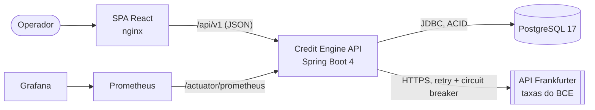

# SRM Credit Engine

Plataforma de **cessão de crédito multimoedas** (BRL/USD) para um FIDC: recebe lotes de recebíveis, calcula o deságio de cada um conforme o risco do tipo e a moeda de pagamento, e registra a liquidação de forma **auditável, com precisão decimal e transações ACID**.

- **Backend:** Java 21 · Spring Boot 4 · PostgreSQL 17 · Resilience4j · Micrometer
- **Frontend:** React 19 · TypeScript · Vite · TanStack Query/Table · Zustand · Mantine
- **Operação:** Docker Compose · Prometheus · Grafana · GitHub Actions · Husky

> **Rodar tudo:** `docker compose up --build -d` e abra http://localhost:3000 (detalhes em [Como rodar](#como-rodar)).

## Sumário

1. [O que foi entregue](#o-que-foi-entregue)
2. [Como rodar](#como-rodar)
3. [Arquitetura](#arquitetura)
4. [Precificação](#precificação)
5. [Integridade e concorrência](#integridade-e-concorrência)
6. [Câmbio e resiliência](#câmbio-e-resiliência)
7. [Extrato de liquidação](#extrato-de-liquidação)
8. [Frontend](#frontend)
9. [Observabilidade](#observabilidade)
10. [Qualidade e verificação](#qualidade-e-verificação)
11. [Fluxo de Git](#fluxo-de-git)
12. [Decisões e fundamentação](#decisões-e-fundamentação)
13. [Limitações e próximos passos](#limitações-e-próximos-passos)
14. [Uso de IA](#uso-de-ia)
15. [Estrutura do repositório](#estrutura-do-repositório)

## O que foi entregue

| Requisito do desafio | Implementação |
|---|---|
| Gestão de câmbio + integração (mockável) | Taxas persistidas com histórico; cadastro manual; sincronização com a **API Frankfurter** (BCE) no startup, agendada e sob demanda. |
| Motor de precificação com **Strategy** | `PricingStrategy` por tipo de recebível (duplicata 1,5% a.m., cheque 2,5% a.m.), `PricingEngine` com `BigDecimal` e conversão cambial no final. |
| Persistência relacional, **ACID**, sem *race conditions* | PostgreSQL; liquidação numa transação única; **optimistic locking** + ETag/If-Match + retry; constraints que reforçam as invariantes. |
| API RESTful + OpenAPI | Contrato definido primeiro ([`docs/api-contract.md`](docs/api-contract.md)); Swagger UI; erros RFC 9457; OpenAPI 3.1 com campos obrigatórios, anuláveis e respostas de erro. |
| Consultas analíticas | Extrato com filtros dinâmicos, paginação e ordenação no servidor, em **SQL nativo** otimizado (p95 de 72 ms sobre 100 mil operações). |
| Arquitetura em 3 camadas (relatórios em 2) | `web → domain → persistence`; extrato em `web → persistence`; regras verificadas por **ArchUnit**. |
| Frontend: painel, grid e arquitetura | Simulação em tempo real, montagem de lote, liquidação; grid server-side com filtros na URL; separação de UI e estado. |
| Tratamento de exceções | `@RestControllerAdvice` global com ProblemDetail, `code` estável e `correlationId`; SPA trata os erros por código. |
| Critérios de aceite | [`docs/acceptance-criteria.md`](docs/acceptance-criteria.md) (30 critérios Dado/Quando/Então, cada um com sua verificação). |
| **Júnior:** commits atômicos, branches, cálculo correto, ER, README | Commits pequenos por branch de funcionalidade; testes com valores exatos; [ER](docs/database/er-diagram.md) e [DDL](docs/database/schema.sql). |
| **Pleno:** Conventional Commits, PRs, histórico limpo, Docker, validações, testes da Strategy | commitlint local e no CI; PRs por branch; histórico linear; `docker-compose.yml`; Bean Validation + Zod; testes parametrizados da Strategy. |
| **Sênior:** hooks, tags, rebase, C4, observabilidade, CI/CD, resiliência, optimistic locking | Husky; tag `v1.0.0`; fixup/autosquash e reordenação; [C4](docs/architecture/c4.md); logs ECS + métricas + Grafana + trace ids; CI/CD no GitHub Actions; retry + circuit breaker; `@Version`. |
| Extra | [ADRs](docs/adr/README.md), idempotência, dashboard como código, Dependabot. |

## Como rodar

### Pré-requisitos

- **Docker** com Compose v2 (é o bastante para rodar tudo).
- Para desenvolvimento: **JDK 21** e **Node 22.12+** (o Maven vem pelo wrapper `./mvnw`).

### Tudo com Docker Compose

```bash
docker compose up --build -d
```

| Serviço | URL |
|---|---|
| SPA do operador | http://localhost:3000 |
| API + Swagger UI | http://localhost:8080/swagger-ui.html (OpenAPI em `/v3/api-docs`) |
| Grafana (dashboard "SRM Credit Engine", acesso anônimo de leitura) | http://localhost:3001 |
| Prometheus | http://localhost:9090 |

- O backend sobe com os perfis `docker,demo`: logs JSON, sincronização com a Frankfurter e uma massa de ~100 mil operações para o extrato (a migração demo leva ~15 s na primeira subida).
- O PostgreSQL não é exposto no host. Para inspecionar: `docker compose exec postgres psql -U srm -d srm_credit_engine`.
- Parâmetros (portas, credenciais, perfis) podem ser sobrescritos via `.env` (veja [`.env.example`](.env.example)).
- Para parar: `docker compose down` (use `-v` para apagar os volumes).

### Desenvolvimento local

**Backend** ([detalhes](backend/README.md)): sobe a API na porta 8080 com um PostgreSQL descartável via Testcontainers (requer Docker):

```bash
cd backend
SPRING_PROFILES_ACTIVE=demo FX_SYNC_ENABLED=true ./mvnw spring-boot:test-run
```

**Frontend** ([detalhes](frontend/README.md)): Vite na porta 5173, com proxy de `/api` para `localhost:8080`. O `npm ci` também ativa os git hooks.

```bash
cd frontend
npm ci
npm run dev
```

### Testes

```bash
cd backend && ./mvnw verify
cd frontend && npm run lint && npm run typecheck && npm test
```

- **Backend:** Spotless, testes unitários, ArchUnit, testes de integração com Testcontainers e WireMock, e o gate de cobertura JaCoCo.
- **Frontend:** lint, typecheck e testes com Vitest, Testing Library e MSW.

## Arquitetura

Monólito modular (uma API stateless) + SPA + PostgreSQL, com Prometheus/Grafana. Diagramas **C4 de contexto e de containers** em [`docs/architecture/c4.md`](docs/architecture/c4.md).



**Camadas do backend:**
- `web` (aplicação): controllers, DTOs, validação, ProblemDetail, correlation-id.
- `domain` (negócio), em módulos:
  - `pricing`: Strategy e engine;
  - `currency`: câmbio;
  - `assignment`: cessão, liquidação e idempotência;
  - `assignor`: cedentes;
  - `treasury`: conta-caixa e ledger.
- `persistence`: repositórios JPA e `report`, que concentra o SQL nativo.
- `integration.fx`: adaptador da Frankfurter.

O ArchUnit garante as dependências permitidas e a ausência de ciclos entre módulos. Modelo de dados: [ER e decisões de modelagem](docs/database/er-diagram.md).

## Precificação

```
Valor Presente = Valor Face / (1 + Taxa Base + Spread) ^ (prazo em dias / 30)
```

- **Strategy por tipo de recebível:**
  - `DuplicataMercantilPricingStrategy` com spread de 1,5% a.m.;
  - `ChequePreDatadoPricingStrategy` com spread de 2,5% a.m.;
  - o `PricingStrategyResolver` falha no startup se algum tipo ficar sem strategy ou tiver duas.

  Um produto novo é uma classe nova, sem mexer no engine.
- **Taxa base por moeda de face:** BRL 1% a.m. e USD 0,5% a.m. (configuráveis).
- **Precisão:**
  - `BigDecimal` com `DECIMAL128` em todos os passos;
  - potência fracionária com `big-math`, nunca `double`;
  - câmbio aplicado **no final**, sobre o valor presente não arredondado;
  - **um único arredondamento `HALF_EVEN`** nas casas da moeda;
  - deságio = face − presente, para que sempre somem o valor de face.
- **Auditoria:** cada recebível guarda um snapshot da taxa base, do spread e do câmbio aplicados.

| Exemplo (operação em 23/09/2026) | Valor presente | Deságio | Líquido |
|---|---|---|---|
| Duplicata, R$ 10.000,00, 90 dias, pago em BRL | R$ 9.285,99 | R$ 714,01 | R$ 9.285,99 |
| Cheque, R$ 10.000,00, 90 dias, pago em BRL | R$ 9.019,43 | R$ 980,57 | R$ 9.019,43 |
| Duplicata, R$ 10.000,00, 90 dias, pago em USD (USD/BRL 5,1322) | R$ 9.285,99 | R$ 714,01 | US$ 1.809,36 |

Detalhes e alternativas: [ADR-0004](docs/adr/0004-pricing-strategy-and-decimal-policy.md).

## Integridade e concorrência

A **liquidação** acontece numa única transação:
1. transição de estado `PENDING → SETTLED` (no domínio);
2. débito da conta-caixa do fundo na moeda de pagamento;
3. movimento no ledger.

**Controle de concorrência e erros**

| Situação | Mecanismo | Resposta |
|---|---|---|
| Dois operadores liquidando a mesma operação | `@Version` + `If-Match` obrigatório (ETag = versão) | Exatamente um vence; o outro recebe `412` ou `409`. |
| Liquidações de operações diferentes disputando o saldo | Colisão de versão na conta-caixa + `@Retryable` (Spring 7) **em volta** da transação | Todas liquidam; o saldo final é exato. |
| Saldo insuficiente | Regra de domínio + `CHECK (balance >= 0)` | `422 INSUFFICIENT_FUNDS`, sem nenhuma alteração. |
| Reenvio após timeout | `Idempotency-Key` + hash do payload | A mesma operação (`200`), ou `409` se o payload mudou. |
| Débito duplo por bug | Índice único parcial: um `DEBIT` por operação | O banco rejeita. |

Os cenários concorrentes são testados com threads reais contra o PostgreSQL (`SettlementConcurrencyIT`). Ver [ADR-0005](docs/adr/0005-optimistic-locking-etag-if-match.md) e [ADR-0006](docs/adr/0006-idempotent-credit-assignment-creation.md).

## Câmbio e resiliência

- **Fonte:** API pública **Frankfurter** (dados do BCE, sem chave), `GET /latest?base=USD&symbols=BRL`.
- **Fora do caminho crítico:** a precificação lê a última taxa persistida (par direto ou inverso derivado) e nunca chama o provedor. A taxa é alimentada pela sincronização no startup, pelo job agendado, pelo `POST /exchange-rates/sync` ou por cadastro manual.
- **Resiliência:**
  - timeouts (2 s de conexão, 3 s de leitura);
  - Retry: 3 tentativas com backoff exponencial e jitter, só para I/O e 5xx;
  - Circuit Breaker: janela de 10 chamadas, 50% de falhas, 60 s aberto.

  Com o provedor fora, o sync responde `503 FX_PROVIDER_UNAVAILABLE` e a precificação segue com a última taxa válida. O estado do circuito aparece no health (sem derrubar a readiness) e no Grafana.
- **Controle de risco:** uma operação cross-currency com taxa mais antiga que 5 dias recebe `422 EXCHANGE_RATE_STALE`. Uma taxa `SEED` permite operar offline, mas taxas observadas sempre têm precedência sobre ela.

Ver [ADR-0008](docs/adr/0008-fx-provider-resilience.md).

## Extrato de liquidação

`GET /api/v1/reports/settlement-statement?from&to&assignorId&currency&status&page&size&sort`

- **Consulta:** SQL nativo com `JdbcClient` que projeta só as colunas do extrato, com `WHERE` dinâmico e sempre com parâmetros nomeados.
- **Ordenação:** whitelist convertida num enum. Qualquer outro valor devolve `400` (com teste de tentativa de injeção).
- **Período:** vira um intervalo meio-aberto no fuso de São Paulo, sem função sobre a coluna indexada.
- **Totais:** denormalizados na operação, então não é preciso agregar recebíveis.
- **Contagem:** `COUNT` sem o join com cedente.
- **Índices:** compostos por filtro + `created_at DESC`.

### Desempenho do extrato

Medido na stack do Docker Compose com a massa demo (**100.000 operações e ~200 mil recebíveis**): 108 requisições HTTP cobrindo 9 combinações de filtros, ordenações e páginas profundas.

| p50 | p95 | p99 | máx. |
|---|---|---|---|
| 11,7 ms | **72 ms** | 77,5 ms | 95 ms |

`EXPLAIN ANALYZE`: primeira página em 0,23 ms; um mês + USD + SETTLED em 0,14 ms; `COUNT` sem filtro em 8,6 ms; `OFFSET 50.000` em 28 ms. Ver [ADR-0007](docs/adr/0007-native-sql-for-reports.md).

## Frontend

- **Painel do operador:** formulário (valor, vencimento, tipo, moeda do título e de pagamento) com **valor líquido recalculado em tempo real**. A cada alteração, com debounce de 300 ms, o servidor recalcula; o cliente nunca faz aritmética financeira. O detalhamento mostra prazo, taxas, valor presente, deságio e câmbio. Depois o operador monta o lote, busca ou cadastra o cedente (CNPJ validado), registra a operação e a liquida ou cancela.
- **Transações:** grid com TanStack Table em modo servidor. Paginação, ordenação e filtros (período, cedente, moeda, status) ficam **na URL**. Um painel lateral mostra o detalhe com as mesmas ações.
- **Câmbio:** taxa vigente com a origem e alertas de taxa derivada ou desatualizada, histórico, cadastro manual, "Sincronizar com Frankfurter" e saldos do fundo.
- **Arquitetura:** `app / pages / features / shared`. Cada feature separa `components/` (só apresentação), `hooks/` e `api/` (dados e regras) e `model/` (schemas Zod e regras puras).
- **Estado:** o estado do servidor fica no TanStack Query; o lote em montagem no Zustand (persistido na sessão); filtros na URL. Os tipos são gerados do OpenAPI e o dinheiro trafega sempre como string.

Ver [ADR-0009](docs/adr/0009-frontend-stack-and-state.md) e [`frontend/README.md`](frontend/README.md).

## Observabilidade

- **Logs estruturados:** JSON (ECS) no perfil `docker`, com `traceId`, `spanId` (Micrometer Tracing/OpenTelemetry) e `correlationId`. O header `X-Correlation-Id` é propagado e devolvido nas respostas e nos erros.
- **Métricas** (Prometheus, `/actuator/prometheus`), todas registradas em zero no startup:
  - operações criadas e liquidadas por moeda;
  - conflitos de liquidação por motivo;
  - latência da precificação;
  - chamadas à Frankfurter por resultado;
  - retries e estado do circuit breaker;
  - HTTP com histograma para p95/p99;
  - JVM e pool de conexões.
- **Dashboard** provisionado como código ([`infra/grafana`](infra/grafana)), com uma seção por tema:
  - negócio;
  - API HTTP (throughput, p95/p99, taxa de 5xx);
  - câmbio e precificação;
  - runtime.
- **Health:** probes de liveness (sem dependências externas) e readiness (banco).

## Qualidade e verificação

| Área | Números |
|---|---|
| Testes do backend | **260**: 185 unitários + 75 de integração (Testcontainers/PostgreSQL, WireMock) |
| Cobertura do backend (JaCoCo) | 96,9% das linhas (97,8% no domínio); gate de ≥ 80% por pacote de domínio |
| Testes do frontend | **118** em 28 arquivos (Vitest, Testing Library, MSW) |
| Cobertura do frontend | 90,8% das linhas, 83,1% dos branches |
| Arquitetura | ArchUnit: camadas e ausência de ciclos entre módulos |
| Contrato | Teste do documento OpenAPI; tipos do frontend gerados a partir dele |

**CI** ([`.github/workflows/ci.yml`](.github/workflows/ci.yml)), a cada push e PR:
- commitlint em todos os commits do PR;
- backend `./mvnw verify`;
- frontend: lint, typecheck, format, testes com cobertura e build;
- build das imagens com cache;
- validação do compose.

**CD** ([`release.yml`](.github/workflows/release.yml)): a tag `vX.Y.Z` publica as imagens no GHCR (versão, `major.minor`, sha) e cria a GitHub Release com notas geradas dos PRs. O Dependabot atualiza Maven, npm, Docker e Actions.

**Git hooks (Husky):**

| Hook | Verificação |
|---|---|
| `pre-commit` | eslint + prettier nos arquivos do frontend e `spotless:check` quando há Java |
| `commit-msg` | Conventional Commits (commitlint) |
| `pre-push` | testes unitários do backend e do frontend |

## Fluxo de Git

**GitHub Flow** com histórico linear ([ADR-0010](docs/adr/0010-git-workflow.md)):
- **Branches e PRs:** `main` sempre implantável, e cada funcionalidade entra por Pull Request a partir de uma branch curta.
- **Integração:** por fast-forward, sem merge commits.
- **Correções durante o desenvolvimento:** viram `fixup!`/`amend!` e entram com `rebase -i --autosquash`. Commits também foram reordenados para agrupar a lógica.
- **Commits:** Conventional Commits validados no hook e no CI.
- **Versões:** SemVer com tag anotada (`v1.0.0`).

A história do repositório, na ordem dos PRs:

| Branch | Conteúdo |
|---|---|
| `docs/api-contract` | Contrato REST definido antes do código (API First) |
| `feature/backend-setup` | Projeto, schema Flyway, ProblemDetail, correlation-id, ArchUnit, Spotless, JaCoCo |
| `feature/currency-engine` | Câmbio, integração com a Frankfurter (retry + circuit breaker), sincronização |
| `feature/pricing-engine` | Strategy, motor de precificação e simulação |
| `feature/credit-assignment-settlement` | Cedentes, cessão com idempotência, liquidação com optimistic locking |
| `feature/settlement-statement` | Extrato em SQL nativo e massa demo |
| `feature/backend-observability` | Actuator/Prometheus, métricas de negócio, logs ECS, tracing, Dockerfile |
| `feature/frontend-setup` → `feature/frontend-docker` | SPA: setup, painel do operador, grid, câmbio, imagem nginx |
| `fix/review-findings` | Correções das revisões: OpenAPI, CNPJs da massa demo, precedência da taxa SEED |
| `chore/devops-tooling` | Compose, Prometheus/Grafana, Husky, CI/CD |
| `docs/architecture` | README, C4, ER/DDL, ADRs, critérios de aceite, uso de IA |

## Decisões e fundamentação

| Escolha | Por quê |
|---|---|
| **Java 21 + Spring Boot 4** | Tipagem forte, `BigDecimal` nativo, transações declarativas, ecossistema maduro. O Boot 4 traz ProblemDetail, logs estruturados, `@Retryable` nativo e JSpecify ([ADR-0001](docs/adr/0001-java-21-spring-boot-4.md)). |
| **PostgreSQL** | ACID, `NUMERIC` exato, constraints como rede de segurança, SQL analítico maduro ([ADR-0002](docs/adr/0002-postgresql-acid-numeric.md)). |
| **Monólito modular** | A liquidação continua sendo uma transação local; os módulos têm fronteiras testadas e podem ser extraídos depois ([ADR-0003](docs/adr/0003-modular-monolith-three-layers.md)). |
| **Flyway** | Schema versionado e revisável; o Hibernate só valida. |
| **big-math** | Potência com expoente fracionário em `BigDecimal` (o JDK só tem expoente inteiro). |
| **Resilience4j** | Circuit breaker e retry maduros, com métricas Micrometer e módulo para o Boot 4. |
| **JdbcClient** | SQL nativo simples e seguro para o relatório, sem geração de código ([ADR-0007](docs/adr/0007-native-sql-for-reports.md)). |
| **Testcontainers + WireMock + ArchUnit** | Testes contra o banco real, provedor externo simulado sem rede e arquitetura verificável. |
| **React + TanStack Query + Zustand** | Separação natural entre o estado do servidor (cache, paginação) e o pouco estado global do cliente ([ADR-0009](docs/adr/0009-frontend-stack-and-state.md)). |
| **openapi-typescript** | O contrato do backend vira tipo no frontend; uma mudança quebra o build, não a produção. |

Todas as decisões: [`docs/adr`](docs/adr/README.md).

## Limitações e próximos passos

- **Autenticação e autorização:** fora do escopo do desafio. O próximo passo é OAuth2/OIDC (resource server) com perfis e dupla aprovação (maker-checker) para liquidações acima de um limite.
- **Escala do extrato:** paginação por cursor (keyset) para navegação profunda, réplica de leitura e índices BRIN por data em tabelas append-only.
- **Conta-caixa como linha quente:** sob altíssima concorrência, distribuir o saldo em sub-contas ou derivar o saldo de um ledger particionado.
- **Eventos:** um outbox transacional publicaria `CreditAssignmentSettled` para contabilidade e custódia, com consistência eventual fora do núcleo transacional.
- **Câmbio:** PTAX do Banco Central como fonte oficial para BRL e múltiplos provedores com fallback. A cotação da operação também poderia expirar (reprecificar pendentes antigas).
- **CNPJ alfanumérico** (novo formato da Receita): hoje só dígitos são aceitos.
- **Testes E2E de navegador** (Playwright) no CI e exportação de traces (OTLP → Tempo/Jaeger).

## Uso de IA

O projeto foi desenvolvido com o Claude Code como co-piloto. Os prompts estratégicos, os erros da IA (e como foram corrigidos) e uma análise crítica estão em [`AI_USAGE.md`](AI_USAGE.md).

## Estrutura do repositório

```
.
├── backend/            API Spring Boot (Maven wrapper, Dockerfile, README)
├── frontend/           SPA React (Vite, nginx, Husky, README)
├── docs/
│   ├── api-contract.md         contrato REST (API First)
│   ├── architecture/c4.md      diagramas C4 (contexto e containers)
│   ├── database/               diagrama ER e DDL
│   ├── adr/                    decisões de arquitetura
│   └── acceptance-criteria.md  critérios de aceite
├── infra/              Prometheus e Grafana (provisionamento e dashboard)
├── .github/            CI, release, Dependabot, template de PR
├── docker-compose.yml
└── AI_USAGE.md
```
