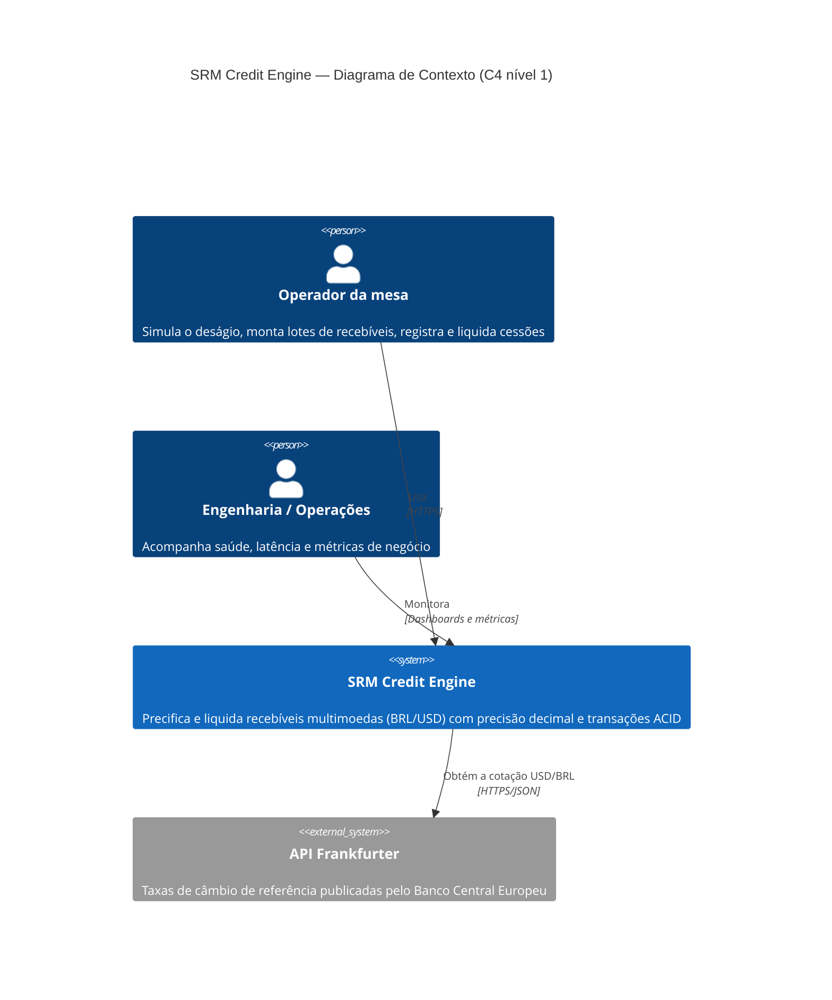
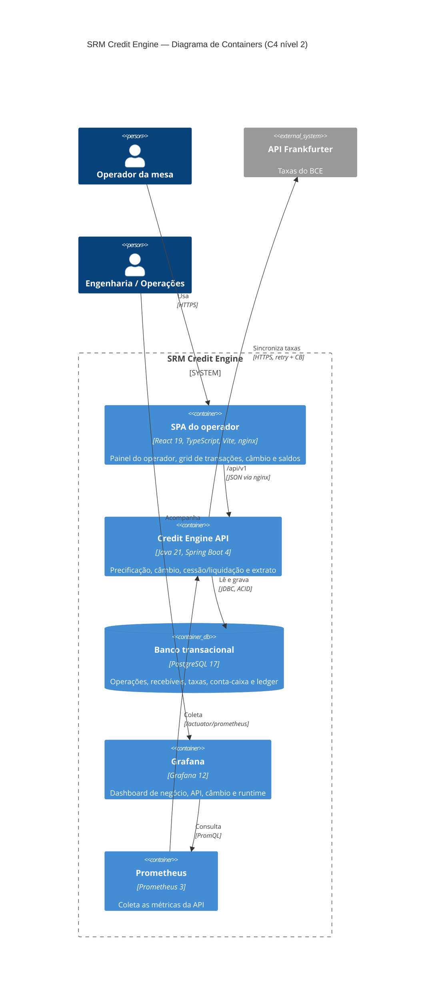
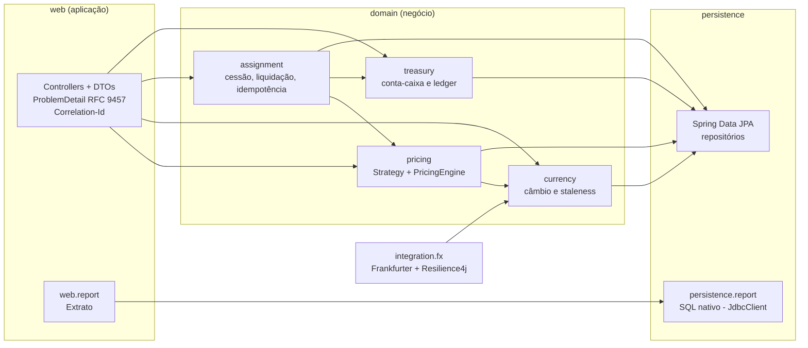

# Arquitetura — Modelo C4

Diagramas no padrão [C4](https://c4model.com/) (Mermaid, renderizados pelo GitHub). Nível 1: o sistema e quem/o que interage com ele. Nível 2: os containers (processos e bancos) que compõem o sistema.

## Nível 1 — Contexto

| Elemento | Responsabilidade |
|---|---|
| **Operador da mesa** | Informa valor, vencimento e tipo do recebível, vê o valor líquido em tempo real, registra o lote (cessão) e liquida. |
| **Engenharia / Operações** | Observa a plataforma: throughput, p95/p99, erros, conflitos de liquidação, estado do circuit breaker. |
| **SRM Credit Engine** | Motor de precificação (Strategy por tipo de recebível), câmbio, cessão e liquidação (ACID + concorrência otimista) e extrato analítico. |
| **API Frankfurter** | Fonte externa das taxas (dados do BCE, publicadas em dias úteis). Fica **fora do caminho crítico**: a precificação usa a última taxa persistida. |

## Nível 2 — Containers

| Container | Tecnologia | Responsabilidade | Escala |
|---|---|---|---|
| **SPA do operador** | React 19 + Vite, servida por nginx (não-root) | UI; estado do servidor com TanStack Query, lote em montagem com Zustand; nunca calcula preço (o servidor é a fonte de verdade). | Estática; CDN. |
| **Credit Engine API** | Java 21, Spring Boot 4, Hibernate 7, JdbcClient | Regras de negócio em 3 camadas (web → domain → persistence); relatório em 2 camadas (web → SQL nativo). | Stateless: réplicas horizontais atrás de um balanceador. |
| **Banco transacional** | PostgreSQL 17 | Fonte de verdade financeira: `NUMERIC(19,2)`/`NUMERIC(19,8)`, FKs e CHECKs que reforçam as invariantes (ex.: `face = deságio + líquido`, saldo ≥ 0). | Vertical + réplicas de leitura para o extrato. |
| **Prometheus / Grafana** | Prometheus 3, Grafana 12 | Métricas técnicas e de negócio; dashboard provisionado como código. | — |

### Fluxos principais

1. **Simulação em tempo real** — a SPA envia `POST /pricing/simulations` com debounce de 300 ms; a API aplica a Strategy do tipo, a taxa base da moeda e, se houver conversão, a última taxa persistida (nunca chama a Frankfurter nesse caminho).
2. **Cessão** — `POST /credit-assignments` (com `Idempotency-Key`) precifica o lote inteiro com um único snapshot de câmbio e persiste operação + recebíveis numa transação.
3. **Liquidação** — `POST /credit-assignments/{id}/settlement` com `If-Match`: numa única transação muda o status, debita a conta-caixa do fundo e grava o movimento no ledger. Conflitos de versão viram 409/412; disputa pelo saldo entre operações diferentes é resolvida com retry em volta da transação.
4. **Câmbio** — um job agendado (e o endpoint de sync) busca a cotação na Frankfurter com timeouts, retry exponencial com jitter e circuit breaker; falhas não afetam a precificação, que segue com a última taxa válida (e recusa taxas mais antigas que 5 dias).
5. **Extrato** — `GET /reports/settlement-statement` executa SQL nativo parametrizado com filtros dinâmicos, ordenação em whitelist e paginação no servidor, apoiado em índices compostos por `created_at`.

### Camadas da API (visão de componentes)

As regras de dependência entre camadas (e a ausência de ciclos entre módulos de domínio) são verificadas por testes ArchUnit (`LayeredArchitectureTest`).
