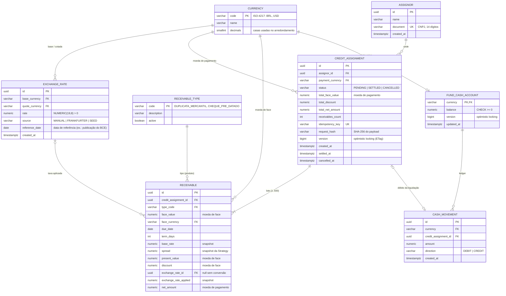

# Modelo de dados

- **DDL completo:** [`schema.sql`](schema.sql) (snapshot gerado com `pg_dump` a partir das migrações).
- **Fonte de verdade:** migrações Flyway em [`backend/src/main/resources/db/migration`](../../backend/src/main/resources/db/migration) — `V1` (schema) e `V2` (dados de referência: moedas, tipos de recebível, contas-caixa e uma taxa `SEED`). A massa de demonstração (~100 mil operações) fica em `db/demo` e só roda no perfil `demo`.

## Diagrama ER

## Como a modelagem reflete o problema financeiro

| Decisão | Por quê |
|---|---|
| **`NUMERIC(19,2)` para valores e `NUMERIC(19,8)` para taxas** (nunca `float`/`double`) | Aritmética decimal exata; o Java usa `BigDecimal` de ponta a ponta e a API trafega valores como string. |
| **Snapshot das taxas em cada recebível** (`base_rate`, `spread`, `exchange_rate_applied`, `exchange_rate_id`) | Auditoria: qualquer operação pode ser recalculada e explicada anos depois, mesmo que spreads e câmbio tenham mudado. |
| **`exchange_rate` append-only** | Histórico imutável de cotações; a "taxa vigente" é a observação mais recente (observadas têm precedência sobre a `SEED`). |
| **Totais denormalizados em `credit_assignment`** | O extrato sobre milhões de linhas não precisa agregar recebíveis; a consistência é garantida pelo CHECK `total_face_value = total_discount + total_net_amount`. |
| **CHECKs de ciclo de vida** (`PENDING` ⇒ sem `settled_at`/`cancelled_at`, etc.) e **`balance >= 0`** | Defesa em profundidade: mesmo um bug na aplicação não consegue gravar um estado financeiro impossível. |
| **`version` em `credit_assignment` e `fund_cash_account`** | Concorrência otimista: duas liquidações simultâneas da mesma operação não podem ambas vencer; a disputa pelo saldo é detectada e repetida. |
| **Índice único parcial `uq_cash_movement_settlement_debit`** (um `DEBIT` por operação) | Garantia no banco de que uma operação nunca é debitada duas vezes. |
| **`idempotency_key` única + `request_hash`** | Reenvio seguro do `POST` de criação (timeouts de rede) sem duplicar a cessão; mesma chave com payload diferente é rejeitada. |
| **UUID v7** | Chaves ordenadas no tempo: boa localidade nos índices B-tree, geradas pela aplicação sem ida ao banco. |
| **`TIMESTAMPTZ` em UTC + data de negócio em `America/Sao_Paulo`** | Instantes sem ambiguidade; filtros de período convertidos para intervalos meio-abertos sobre a coluna indexada. |

## Índices do extrato

| Índice | Atende |
|---|---|
| `ix_credit_assignment_created_at (created_at DESC, id DESC)` | Listagem padrão e paginação por data |
| `ix_credit_assignment_assignor_created_at (assignor_id, created_at DESC)` | Filtro por cedente + período |
| `ix_credit_assignment_currency_created_at (payment_currency, created_at DESC)` | Filtro por moeda + período |
| `ix_credit_assignment_status_created_at (status, created_at DESC)` | Filtro por status + período |

Medições com 100 mil operações estão no [README](../../README.md#desempenho-do-extrato).
